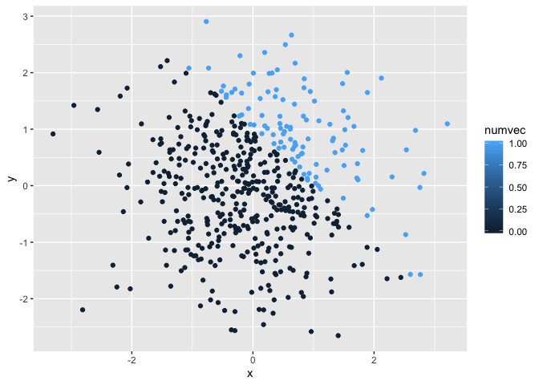
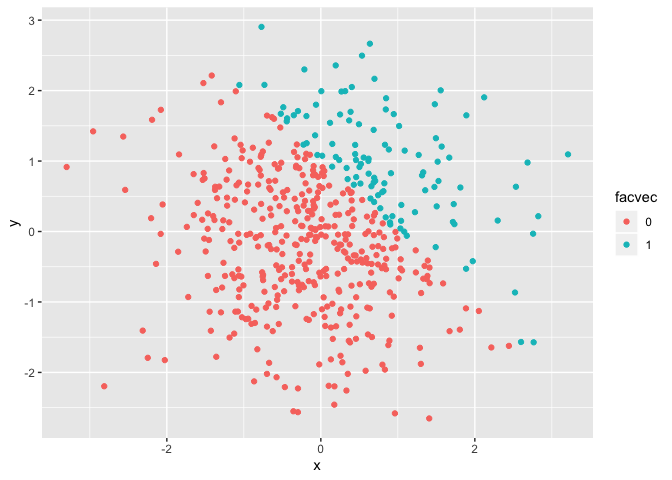

p8105\_hw1\_az2356
================
Amelia Zhao
9/19/2019

# This is my markdown file for Homework 1.

# Problem 1

Creating a data frame comprised of:

  - a random sample of size 8 from a standard Normal distribution

  - a logical vector indicating whether elements of the sample are
    greater than 0

  - a character vector of length 8

  - a factor vector of length 8, with 3 different factor “levels”

Loading the tidyverse lib so we can create a dataframe using
    tibble:

``` r
library(tidyverse)
```

    ## ── Attaching packages ─────────────────────────── tidyverse 1.2.1 ──

    ## ✔ ggplot2 3.2.1     ✔ purrr   0.3.2
    ## ✔ tibble  2.1.3     ✔ dplyr   0.8.3
    ## ✔ tidyr   0.8.3     ✔ stringr 1.4.0
    ## ✔ readr   1.3.1     ✔ forcats 0.4.0

    ## ── Conflicts ────────────────────────────── tidyverse_conflicts() ──
    ## ✖ dplyr::filter() masks stats::filter()
    ## ✖ dplyr::lag()    masks stats::lag()

Setting the seed so that the random number generator will generate the
same numbers each time- keeping things boring and predictable….

``` r
set.seed(10)
```

Creating a dataframe as described above:

``` r
hw1p1_df = tibble(
  numbers = rnorm(8),
  over1 = c(numbers > 0),
  fruitfamily = c("peach", "apple", "lemon", "banana", "koreanmelon", "cantaloupe", "watermelon", "lime"),
  sweetness = factor(c("sweet", "sweet", "sour", "sweetish", "sweetish", "sweet", "sweet", "sour"))
  
)

# Printing the dataframe:
hw1p1_df
```

    ## # A tibble: 8 x 4
    ##   numbers over1 fruitfamily sweetness
    ##     <dbl> <lgl> <chr>       <fct>    
    ## 1  0.0187 TRUE  peach       sweet    
    ## 2 -0.184  FALSE apple       sweet    
    ## 3 -1.37   FALSE lemon       sour     
    ## 4 -0.599  FALSE banana      sweetish 
    ## 5  0.295  TRUE  koreanmelon sweetish 
    ## 6  0.390  TRUE  cantaloupe  sweet    
    ## 7 -1.21   FALSE watermelon  sweet    
    ## 8 -0.364  FALSE lime        sour

Taking the mean of each variable in the
    dataframe:

``` r
mean(pull(hw1p1_df, numbers))
```

    ## [1] -0.3779272

``` r
mean(pull(hw1p1_df, over1))
```

    ## [1] 0.375

``` r
mean(pull(hw1p1_df, fruitfamily))
```

    ## Warning in mean.default(pull(hw1p1_df, fruitfamily)): argument is not
    ## numeric or logical: returning NA

    ## [1] NA

``` r
mean(pull(hw1p1_df, sweetness))
```

    ## Warning in mean.default(pull(hw1p1_df, sweetness)): argument is not numeric
    ## or logical: returning NA

    ## [1] NA

Only the mean for the numeric and logical vectors will run. Complex
vectors such as factor and character cannot have their means calculated,
they can only be trimmed.

Converting variables from logical, character, and factor to numeric.

``` r
over1 <- as.numeric(pull(hw1p1_df, over1))
fruitfamily <- as.numeric(pull(hw1p1_df, fruitfamily))
```

    ## Warning: NAs introduced by coercion

``` r
sweetness <- as.numeric(pull(hw1p1_df, sweetness))
```

The character vector cannot be converted into a numeric vector because
there is no numeric variable to associate with it. For the logical
vector, as.numeric makes it 0 if false, and 1 if true. For the factor
vector, as.numeric outputs the underlying numeric representation. For
the logical vector, these values are what are used for the mean
calculation. For the factor vector, R assigns values when we ask it to,
but will not otherwise because these can be misleading/meaningless
values.

Converting and multiplying vectors:

``` r
overnum <- as.numeric(pull(hw1p1_df, over1))
pull(hw1p1_df, numbers)*overnum
```

    ## [1] 0.01874617 0.00000000 0.00000000 0.00000000 0.29454513 0.38979430
    ## [7] 0.00000000 0.00000000

``` r
overfactor <- as.factor(pull(hw1p1_df, over1)) 
pull(hw1p1_df, numbers)*overfactor
```

    ## Warning in Ops.factor(pull(hw1p1_df, numbers), overfactor): '*' not
    ## meaningful for factors

    ## [1] NA NA NA NA NA NA NA NA

``` r
overnum2 <- as.numeric(as.factor(pull(hw1p1_df,over1)))
overnum2*pull(hw1p1_df, numbers)
```

    ## [1]  0.03749234 -0.18425254 -1.37133055 -0.59916772  0.58909025  0.77958860
    ## [7] -1.20807618 -0.36367602

# Question 2

``` r
set.seed(600)
plotdata = tibble(
  x = rnorm(500),
  y = rnorm(500),
  greater1 = c((x + y) > 1),
  numvec = as.numeric(greater1),
  facvec = as.factor(numvec)
)

plotdata
```

    ## # A tibble: 500 x 5
    ##          x       y greater1 numvec facvec
    ##      <dbl>   <dbl> <lgl>     <dbl> <fct> 
    ##  1 -1.12    1.32   FALSE         0 0     
    ##  2  0.198  -1.35   FALSE         0 0     
    ##  3  0.645   0.468  TRUE          1 1     
    ##  4 -0.151  -0.0471 FALSE         0 0     
    ##  5 -0.0184  0.644  FALSE         0 0     
    ##  6  0.0177  0.833  FALSE         0 0     
    ##  7 -1.22    0.481  FALSE         0 0     
    ##  8 -1.65    0.815  FALSE         0 0     
    ##  9  0.0385 -0.559  FALSE         0 0     
    ## 10 -1.37    0.635  FALSE         0 0     
    ## # … with 490 more rows

``` r
nrow(plotdata)
```

    ## [1] 500

``` r
ncol(plotdata)
```

    ## [1] 5

``` r
mean(pull(plotdata,x))
```

    ## [1] -0.02845306

``` r
median(pull(plotdata, x))
```

    ## [1] -0.05587947

``` r
sd(pull(plotdata,x))
```

    ## [1] 0.9895792

``` r
mean(pull(plotdata,numvec))
```

    ## [1] 0.218

The data frame contains 500 rows and 5 columns. The x variable’s mean is
-0.028, median is -0.0559, and standard deviation is 0.989

The proportion of cases for which x + y \> 1 is 0.218. Since the logical
vector will be returned as 1 (true) or 0 (false), so the mean will equal
the number of true values (1 in numvec) over the total number of values.

Plot colored according to the logical
variable:

``` r
plotplot <- ggplot(plotdata, aes(x = x, y = y, color = greater1)) + geom_point()


ggsave ("plotdata.pdf", plot = plotplot)
```

    ## Saving 7 x 5 in image

Plot colored according to the numeric variable:

``` r
ggplot(plotdata, aes(x = x, y = y, color = numvec)) + geom_point()
```

<!-- -->

Plot colored according to the factor variable:

``` r
ggplot(plotdata, aes(x = x, y = y, color = facvec)) + geom_point()
```

<!-- -->

The color scales are similar for the logical and factor variables
because they are whole integers of essentially presence (1, true) or
absence (0, false). The numeric variable can vary and so the color scale
in the key has a gradient. However, the color in the plot is still the
color for 1 or 0 because it is based off of the logical variable.
